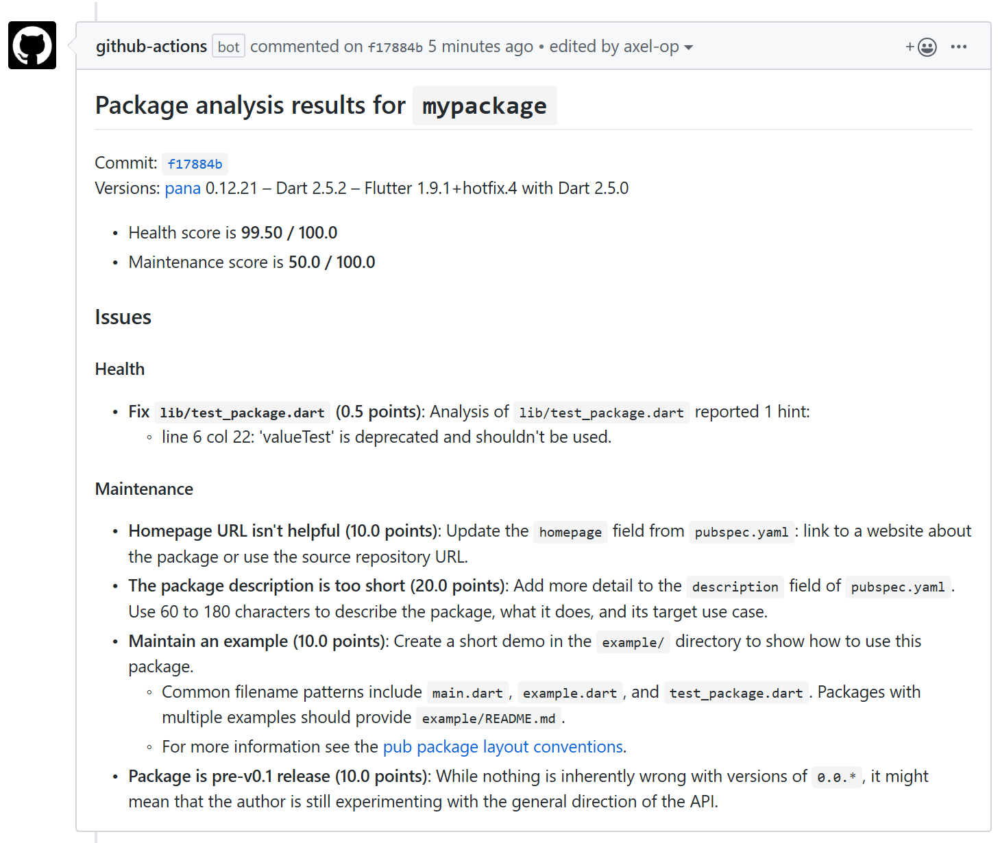

# Dart/Flutter package analyzer

This action uses the [pana (Package ANAlysis) package](https://pub.dev/packages/pana) to compute the score that your Dart or Flutter package will have on the [Pub site](https://pub.dev), and post it as a commit comment, with suggestions for improvements. It also comments lines where code issues have been found. 

This package, amongst other things:
* checks code formatting with `dartfmt` or `flutter format` (detected automatically),
* validates the code by performing static analysis with [dartanalyzer](https://dart.dev/tools/dartanalyzer) and comments the lines with issues,
* checks for outdated dependencies,
* validates the `pubscpec.yaml` file (dependencies, description's length...),
* checks for required files (`CHANGELOG`, `README`, `example` folder...)
* ...

## Example



## Usage

You must include the `actions/checkout` step in your workflow. Here's an example:
```yml
name: Workflow example
on: [push, pull_request]

jobs:
  package-analysis:
    runs-on: ubuntu-latest
    steps:
      - uses: actions/checkout@v1 # required
      - uses: axel-op/dart_package_analyzer@master
        with:
          githubToken: ${{ secrets.GITHUB_TOKEN }} # required
          eventPayload: ${{ toJson(github.event) }} # required
          commitSha: ${{ github.sha }} # required
          maxScoreToComment: 99.99 # not required
```

* `githubToken`, `eventPayload`, and `commitSha` inputs are required to post a comment on GitHub.
* Use `maxScoreToComment` if you only want to have a comment if your score is lower than this. If you don't specify it, a comment will be posted for every commit that triggers the workflow. In this example, a comment won't be posted if the score is above 99.99, that is, if it equals 100. 

