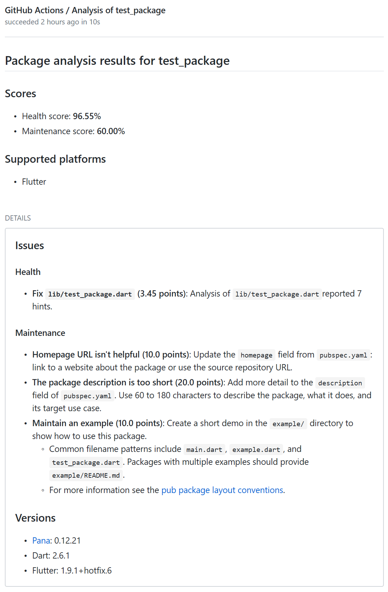

# Dart/Flutter package analyzer

This action uses the [pana (Package ANAlysis) package](https://pub.dev/packages/pana) to compute the score that your Dart or Flutter package will have on the [Pub site](https://pub.dev/help/scoring).

This package, amongst other things:

* validates the code by performing static analysis with [dartanalyzer](https://dart.dev/tools/dartanalyzer),
* checks code formatting with [`dartfmt`](https://dart.dev/tools/dartfmt) or [`flutter format`](https://flutter.dev/docs/development/tools/formatting#automatically-formatting-code-with-the-flutter-command) (detected automatically),
* checks for outdated dependencies,
* validates the `pubspec.yaml` file (dependencies, description's length...),
* checks for required files (`CHANGELOG`, `README`, `example` folder...)
* ...

The pana package gives scores in five categories and sum them up to get your total score.

## Usage

You must include the [`actions/checkout`](https://github.com/actions/checkout) step in your workflow. You **don't** need to run `pub get` or build a Dart container before.

This action uses its own Dart container. I recommend you to run it in a separate job, as [jobs run in parallel](https://help.github.com/en/actions/reference/workflow-syntax-for-github-actions#jobs).

### Inputs

* `githubToken`  
Required to post a report on GitHub. *Note:* the secret [`GITHUB_TOKEN`](https://help.github.com/en/actions/automating-your-workflow-with-github-actions/authenticating-with-the-github_token) is already provided by GitHub and you don't have to set it up yourself.
* `relativePath`  
If your package isn't at the root of the repository, set this input to indicate its location.

Example:

```yml
name: Example workflow
on: [push, pull_request]

jobs:

  package-analysis:

    runs-on: ubuntu-latest

    steps:
      - uses: actions/checkout@v2 # required

      - uses: axel-op/dart-package-analyzer@v3
        with:
          # Required:
          githubToken: ${{ secrets.GITHUB_TOKEN }}
          # Optional:
          relativePath: packages/mypackage/
```

### Outputs

There is an output for each of the [six categories](https://pub.dev/help/scoring) that are evaluated by the pana package, whose value is the score obtained by your package, plus an output for the total score of your package.

For each of these outputs, there is also a `..._max` output corresponding to the maximum score that a package can have in the category.

There is also an output containing the full `pana` output in JSON format if you need to parse it yourself.

You can use the outputs in the next steps of your workfow by [associating an id to this action](https://help.github.com/en/actions/automating-your-workflow-with-github-actions/workflow-syntax-for-github-actions#jobsjob_idsteps). In the following steps, you can retrieve an output with `${{ steps.the_id.outputs.name_of_output }}` (see the example below).

* `total` & `total_max`  
The total score of your package, and the maximum score that it can get.

* `conventions` & `conventions_max`  
Score for the category __*Follow Dart file conventions*__.

* `documentation` & `documentation_max`  
Score for the category __*Provide documentation*__.

* `platforms` & `platforms_max`  
Score for the category __*Support multiple platforms*__.

* `analysis` & `analysis_max`  
Score for the category __*Pass static analysis*__.

* `dependencies` & `dependencies_max`  
Score for the category __*Support up-to-date dependencies*__.

* `null_safety` & `null_safety_max`  
Score for the category __*Support null-safety*__.

* `json_output`
The `pana` output in JSON format.

#### Usage example

```yml
name: Example workflow
on: [push, pull_request]

jobs:

  package-analysis:

    runs-on: ubuntu-latest

    steps:
      - uses: actions/checkout@v2

      - uses: axel-op/dart-package-analyzer@v3
        # set an id for the current step
        id: analysis
        with:
          githubToken: ${{ secrets.GITHUB_TOKEN }}

      # You can then use this id to retrieve the outputs in the next steps.
      # The following step shows how to exit the workflow with an error if the total score in percentage is below 50:
      - name: Check scores
        env:
          # NB: "analysis" is the id set above. Replace it with the one you used if different.
          TOTAL: ${{ steps.analysis.outputs.total }}
          TOTAL_MAX: ${{ steps.analysis.outputs.total_max }}
        run: |
          PERCENTAGE=$(( $TOTAL * 100 / $TOTAL_MAX ))
          if (( $PERCENTAGE < 50 ))
          then
            echo Score too low!
            exit 1
          fi
```

## Example


